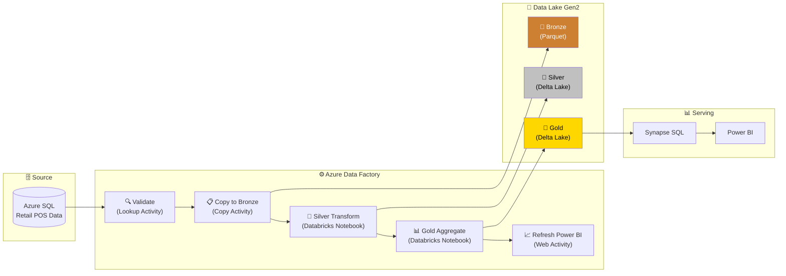

# 🏭 Azure-ETL-Factory — Batch Pipeline with ADF

<p align="center">
  
  
  
  
  
  
</p>

## 🎯 Project Overview

Batch ETL pipeline for **retail sales data** orchestrated by **Azure Data Factory**. ADF copies data from Azure SQL to the Data Lake, triggers Databricks notebooks for Bronze/Silver/Gold transformations, and refreshes Power BI dashboards via Synapse Serverless SQL.

## 🏗️ Architecture



## 🚀 Features

- ⚙️ **ADF orchestration** with Lookup, Copy, Databricks, and Web activities
- 🔄 **Retry & monitoring** — 2 retries, 5-min interval, email alerts on failure
- 🔐 **Secure** — Azure Key Vault for secrets, Managed Identity authentication
- 📅 **Parameterized** — `run_date` enables backfill for historical reprocessing
- 🔄 **Idempotent** — Delta Lake MERGE prevents duplicates on re-runs
- 📊 **Auto-refresh** — triggers Power BI dataset refresh after Gold completion

## 🛠️ ADF Pipeline Design

```
[Validate Source] → [Copy to Bronze] → [Silver Transform] → [Gold Aggregate] → [Refresh Power BI]
     Lookup            Copy Activity     Databricks Notebook  Databricks Notebook    Web Activity
```

## 📂 Project Structure

```
Azure-ETL-Factory/
├── 📁 adf/
│   ├── pipelines/
│   │   └── pipeline_daily_etl.json     # ADF pipeline definition
│   ├── datasets/
│   │   ├── ds_source_sql.json          # Source dataset
│   │   └── ds_bronze_parquet.json      # Bronze dataset
│   └── linkedservices/
│       ├── ls_source_sqldb.json        # SQL linked service
│       ├── ls_datalake.json            # Data Lake linked service
│       └── ls_databricks.json          # Databricks linked service
├── 📁 notebooks/
│   ├── 01_bronze_ingestion.py          # Parquet to Delta Lake
│   ├── 02_silver_transform.py          # Dedup + Enrich + MERGE
│   └── 03_gold_aggregate.py            # Store + Category + Regional
├── 📁 sql/
│   └── create_views.sql                # Synapse SQL views for Power BI
├── 📁 tests/
│   └── test_transformations.py
└── requirements.txt
```

## 📈 Gold Layer Outputs

| Output | Metrics |
|--------|---------|
| 🏪 **Store Daily** | Gross/net revenue, transactions, basket size, discount & online rates |
| 📦 **Category Trends** | Monthly revenue, units sold, avg selling price by category |
| 🌍 **Regional Revenue** | Revenue by region/country, active stores, unique customers |

## ⚙️ Setup & Run

```bash
pip install -r requirements.txt
python src/generators/retail_generator.py
pytest tests/ -v
```

## 👨‍💻 Author

**Othmane Sadiki** — Data Engineer

[](https://www.linkedin.com/in/sadiki-othmane/)
[](https://github.com/othmanestd)
